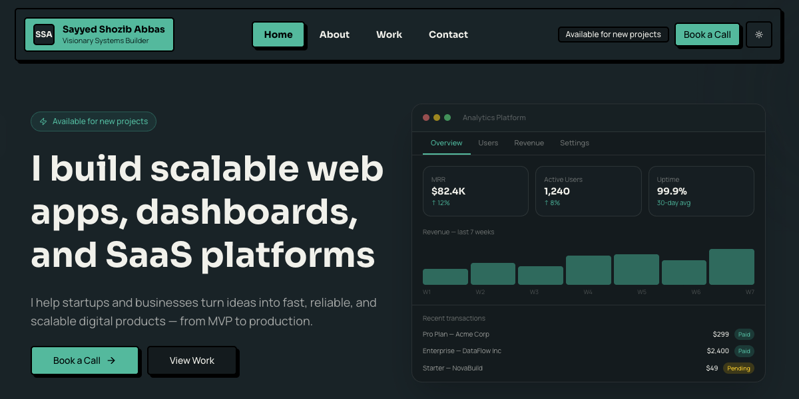

<p align="center">
  
</p>

# Sayyed Shozib Abbas Portfolio

This repository is the source code for my public portfolio at [shozibabbas.com](https://shozibabbas.com).

I made it public for two reasons:

1. To showcase the kind of product engineering and UI work I do
2. To give other developers a real project they can study, reuse, and adapt

This is not just a personal site. It is also a practical reference for building a modern portfolio with a bold neobrutalist UI, solid SEO foundations, reusable UI primitives, and clean App Router structure.

## Why this repo exists

Most portfolio repositories are either too minimal to learn from or too personalized to reuse cleanly.

This one is meant to be useful.

You can use it as:

- A portfolio starter built with Next.js and Tailwind CSS
- A neobrutalism.dev-inspired design sample
- A reference for structuring content-heavy App Router sites
- An example of modern SEO, Open Graph, sitemap, robots, and analytics setup
- A source of reusable UI patterns for marketing pages and portfolio work

## Screenshots

### Homepage

<p align="center">
  
</p>

## Design direction

The visual system is based on the [neobrutalism.dev](https://neobrutalism.dev/) style and adapted into a more polished, modern portfolio UI.

It uses:

- Strong black borders
- Hard offset shadows
- Compact rounded corners
- High-contrast surfaces
- Tactile hover states and motion
- Light and dark theme support

The goal was not to make a generic polished SaaS landing page. The goal was to make something with stronger visual identity while still feeling usable, modern, and production-ready.

If you want to understand the design system in detail, see [UI_STYLEGUIDE.md](UI_STYLEGUIDE.md).

## Tech stack

- Next.js 16 with App Router
- React 19
- TypeScript
- Tailwind CSS v4
- Radix UI primitives
- next-themes for theme switching
- Google Analytics 4
- Static SEO assets including sitemap, robots, and Open Graph image

## What is worth studying here

If you are reading this repo to learn how it works, these are the most useful parts:

- `src/app` for routing, page-level metadata, sitemap, robots, and layout structure
- `src/sections` for homepage composition and marketing-style sections
- `src/components/ui` for reusable neobrutalist UI primitives
- `src/components` for app-specific pieces like navigation, links, analytics, and case study presentation
- `src/data` for structured content used across the site
- `src/lib/metadata.ts` for shared SEO/Open Graph metadata logic
- `public` for screenshots, CV, and social preview assets

This repo is intentionally simple to navigate. The content layer and UI layer are separated cleanly enough that you can either study the architecture or replace the content with your own.

## Reusing this repository

You are free to fork this repository, study it, and adapt it to your own needs, subject to the repository license.

Good reuse paths:

- Replace the portfolio content with your own and keep the structure
- Use the UI system as a starting point for a neobrutalist portfolio
- Borrow the SEO, metadata, sitemap, Open Graph, and analytics setup
- Reuse the case study presentation approach for product or agency websites

If you fork this project, the main places you will likely want to update first are:

- `src/app/layout.tsx` for global metadata
- `src/app/page.tsx`, `src/app/about/page.tsx`, `src/app/work/page.tsx`, `src/app/contact/page.tsx` for page content
- `src/data/*` for experience, education, skills, and projects
- `src/components/links.tsx` and `src/components/nav.tsx` for contact and navigation
- `public` for your screenshots, resume, favicon, and Open Graph image

## Running locally

### Prerequisites

- Node.js 20+
- npm or pnpm

### Install

Using npm:

```bash
npm install
```

Using pnpm:

```bash
pnpm install
```

### Start development server

Using npm:

```bash
npm run dev
```

Using pnpm:

```bash
pnpm dev
```

Then open `http://localhost:3000`.

### Production build

```bash
npm run build
```

## Available scripts

- `npm run dev` starts the local development server
- `npm run build` creates the production build
- `npm run start` runs the production app
- `npm run lint` runs linting
- `npm run screenshot:vertboard` captures the VertBoard screenshot
- `npm run screenshot:babyday` captures the BabyDay screenshot
- `npm run screenshot:hudlink` captures the HudLink screenshot

## SEO and social sharing

This repository includes a complete baseline SEO setup:

- Global metadata in the root layout
- Per-page metadata for homepage, about, work, and contact pages
- Open Graph and Twitter card tags
- Custom Open Graph thumbnail in `public/og-thumbnail.png`
- `sitemap.xml` generation
- `robots.txt` generation
- Google Analytics 4 integration gated to production mode

If you reuse this repo, do not forget to update:

- Site URL
- Metadata titles and descriptions
- Open Graph image
- Analytics measurement ID

## Neobrutalism sample value

If your main interest is the design system, this repository is useful because it shows neobrutalism in a real site rather than a toy component demo.

It includes:

- Reusable UI primitives built on Radix
- Consistent token-driven styling in `src/app/globals.css`
- Practical application of neobrutalist patterns in navigation, cards, CTAs, tabs, dialogs, and case study layouts
- A balance between expressive visuals and production-friendly structure

That makes it a good reference if you want to build:

- A portfolio
- A founder site
- A small product marketing site
- A component system inspired by neobrutalism.dev but adapted for modern usage

## Deployment

This project is ready to deploy on Vercel and also works with other Node-compatible hosting platforms.

For Vercel:

1. Import the repository
2. Keep the default Next.js settings
3. Add any required environment variables
4. Deploy

## A note on attribution and reuse

If you reuse this code, customize it properly.

Do not just change the name and ship it unchanged. Replace the content, screenshots, metadata, links, CV, and branding so it actually reflects your work.

The repository is public because I want it to be useful, not because I want cloned portfolios floating around unchanged.

## License

This repository is available under the terms in [LICENSE](LICENSE).
